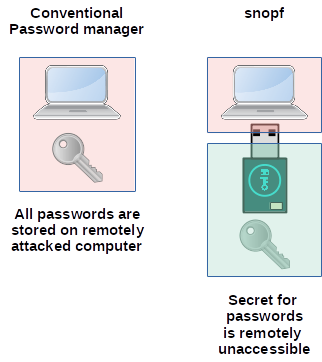
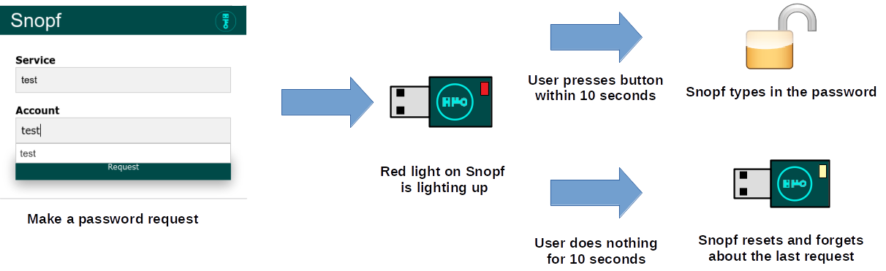

# Snopf USB password token

> Info: The password creation algorithm for Snopf has been fundamentally changed since 6b1df42b0c21d2e936d6018c70f1937114251a39. The new firmware and the new tools and account table files aren't compatible with the former version. The command line tool has been deprecated. Snopf also switched from using a 128 bit secret to using a 256 bit secret on the device. For upgrading the firmware you can use the firmware updater from the bootloader repository [here](https://github.com/Snopf/Snopf_bootloader). For installation and configuration follow this readme.

## What is Snopf?


Snopf is a very simple, yet effective and easy to use USB password tool. The Snopf USB device creates a unique and strong password for every service from the same 256 bit secret which never leaves the token.

Whenever Snopf is plugged into the computer you can make a password request and then the red LED will light up. If you press the button within 10 seconds Snopf will imitate a keyboard and type the password for the requested service.

Snopf is designed as a hardware-based password generator to tackle the security issues most commonly encountered with stored passwords on ordinary PCs, such as reading of password files by malware or browser exploits. It generates passwords deterministically from a securely kept master secret unaccessible to software running on the host. 

For more details on security and how it works, see the section *Security considerations* and *Operation principle* below.
Instructions on how to build your own are found in the section *Hardware* and *Building the Firmware and Host Software*. A short manual on how to use Snopf after you installed the software is found in *How to use it*.

## Advantages of Snopf

* Very simple and robust design
* Easy to use
* You don't have to remember any passwords anymore (except preferably a master PIN for Snopf)
* Every password is unique and as strong as the accessed service allows
* The actual password creation is only happening on the USB device
* It is possible to restore all passwords from a 24 word mnemonic representing the 256 bit secret
* It's more secure than a common pure software based password manager because the password creation is physically detached from the computer
* As Snopf emulates a regular keyboard, no passwords are stored in the clipboard

### Advantage over Common Software Password Managers
Common software password managers are very good tools to create and manage strong passwords for all your logins. Still, there is a possibility of your computer being remotely attacked and an attacker is able to access your password database getting all your login credentials.
Snopf is an improvement over these managers because an attacker can't access your Snopf token remotely. All passwords are derived from the secret on the device which an attacker must have phyiscal access to. So there is an additional *physical barrier* for an attacker.



## Using Snopf
<!-- TODO show detailed 'how to use' -->
### Snopf QT
Snopf-QT is the GUI tool to manage the account table for Snopf and to interact with the USB device.

### Account table
With Snopf-QT you can create new entries, delete entries and change entries in the account table. A Snopf account table is a simple json with entries for every unique (service, account) combination. Each entry has six fields:

1. `Service` = Hostname or service name for the login, for example the email service `examplemail.com`
2. `Account` = Your account at this service, for example the email address for the email service `my_mail_address@examplemail.com`
3. `Password length` = The password length you set for this service
4. `Password iteration` = An integer for every unique (service, account) combination which you increase if you have to set a new password for this combination for example after a databreach at the used service.
5. `Rules` = Rules for password creation, for example 'The password must include a lowercase character'
6. `Keymap` = A keymap which will be used for the password creation which allows to include and exclude certain characters

The account table file is AES encrypted on the hard disk using the same master password (not the master secret on the USB device!) that is used whenever a password request is submitted.

#### Change secret
You can change the secret on the Snopf device using Snopf-QT.
<!-- TODO show detailed 'how to use' -->

### Browser plugins

An everyday usecase of Snopf are user logins into web sites where you use the Snopf browser plugin. The general process of a password request is outlined in the picture below.



The browser plugin can access the same account table as the Snopf_manager so you can fill out the account field by selecting known accounts from the table. With the browser extension you can make password requests and you can select to store newly typed in service + account combinations in the account table, but you can't remove existing accounts or change their settings.

## Restoring passwords

To restore passwords, for example after losing or damaging Snopf, you need to be in possesion of the following data:

1. The Snopf's secret (comfortably as a 24 word mnemonic)
2. The optional master password (if you used one)
3. The account table

You might not absolutely need the account table if you have your logins, like email address and email service in your memory and just used passwords with default settings. Even if you need to remember *password iteration* you can just try out low numbers there.

Apart from that it is strongly advised to backup the account table and use a master password that you can remember. You should write down the 24 word mnemonic for the Snopf secret and store at a safe place.

With the above information you will be able to recreate all your passwords.

## Security considerations
Snopf isn't 100 % secure and a certain tradeoff between security, usability and economics has been made. Make sure to use Snopf only with your own or trusted PCs. It is also assumed that an adversary does not come into physical possesion of your Snopf. However, in case Snopf gets lost or is stolen, a reasonable safe master passphrase (the two-factor authentication approach) will still fend off or at least slow the attacker, depending on the strength of this passphrase.

Snopf has not been designed or further analyzed vs. more advanced attacks such as power analysis or timing side-channel attacks and could be theoretically vulnerable to either. Attacks of this and similar kinds are deemed outside the scope of the threat model that Snopf defends against. So far, regular computers don't seem to allow detailed current measurement at their USB ports which could potentially be used for remote attacks. More sophisticated attacks such as relying on analyzing the microcontroller's electromagnetic emissions are not deemed a common threat.
Timing attacks are similarly not expected to be a huge issue. The SHA256 crypto primitive used by Snopf runs in constant time. The iterated hashing to yield a password matching "password_valid" will cause some timing variation for a minority of passworts. However, as Snopf relies on a *manual* button press for replying with the password, a large amount of noise is added and makes analyses along this line a lot less feasible.

The ATtiny85 does not include a secure enclave (or similar) and reading out the microcontroller might be possible if an attacker has physical access. It can be made harder by setting the lockbits for the AVR but a capable attacker will be able to access the EEPROM data (where the secret is stored) eventually. A reasonable safe master passphrase will still prevent logins by an attacker at least for some time to create new passwords.

Passwords typed in by Snopf can of course still be intercepted by a keylogger and might land in the RAM and swap memory of the host where malware might access them. Covering those attack vectors is likewise out of scope for Snopf.
 
## Password Creation Algorithm
The password creation algorithm is explained in-depth [here](../readme/password_algo.pdf).

## Hardware
You can find a KiCad project for Snopf in the `hardware` subfolder and also a PDF of the current schematic [here](https://github.com/Snopf/Snopf/blob/master/readme/schematic.pdf). The KiCad project also includes a PCB layout for a SMD version.

Bill of materials for the SMD version:
* ATTINY85-20SU SO(1)
* Resistor 10k 0603 (1)
* Resistor 220R 0603 (1)
* Resistor 1k 0603 (1)
* Resistor 1k5 0603 (1)
* Resistor 68R 0603 (2)
* Capacitor 18pF 0603 (2)
* Capacitor 100n 0603 (1)
* Capacitor 4u7 0805 (1)
* Crystal 12 Mhz 4 Pin (1)
* LED red 0603 (1)
* USB connector (1)
* Zener Diode 3,6V Mini Melf (2)
* Button Panasonic EVQQ2 (1)

There are links for Mouser parts that work for the PCB layout to be found in the KiCad schematic.

## Casing
A 3D printable casing can be found at `hardware/casing` both as a FreeCAD file and as four STEP files (bottom, top, button and a cap for the USB plug). The button is designed as a silicone button so that the diffuse LED light can been seen through it.
The dimensions of the casing are 41.9 x 19.4 x 11 mm.

## Running and building the Snopf software

### Python Venv
To avoid bugs and conflicts due to different versions of installed python packages it is advised to initialize a Python virtual enviroment for all operations described in this section. This includes running the python code as well as building binaries for either the AVR or the PC. Alternatively you can have a look at `src/py_requirements.txt` to see which Python packages and which versions are used for Snopf and install them accordingly.
To create a Python Venv you can simpy run
```
$ ./setup_py_env.sh
```
in the Linux console and
```
$ ./setup_py_env.ps1
```
in the Windows PowerShell. This will create a `.venv` directory with all necessary packages installed and activate that virtual enviroment for the current session.
To activate the virtual enviroment for the current session you run
```
$ source .venv/bin/activate
```
in the Linux console and
```
$ ./.venv/scripts/activate.ps1
```
in the Windows PowerShell.

### Linux udev rule
There is an udev rule for allowing USB acces to Snopf located in `src/host` which you can copy to `/etc/udev/rules.d` or you can simply run
```
$ ./install_usb_rule.sh
```

### Building the Firmware
You can compile the AVR code and program the AVR using the standard GNU toolchain using
```
$ make program
```
in the avr source directory `src/avr`. You'll probably have to alter the `Makefile` for your kind of programmer.

There also exists a bootloader written for this project, you can find it here [Snopf bootloader](https://github.com/Snopf/Snopf_bootloader) so that you can update the code on the device via USB. The bootloader is not necessary but it comes in handy for updating the firmware.

### Running the Snopf QT Python code
After activating the Python virtual enviroment you can run the QT app as a Python script by running
```
python snopf_manager.py
```
in `src/host/pc`.

### Building Snopf QT Binaries for Linux
You can build a stand-alone binary for Snopf using PyInstaller. Just run `make` in `src/host/pc`.
It is advised to run `make` in the Python virtual enviroment to ensure that all needed packages are installed using the correct version.
The output will be created in `src/host/dist`.

### Building Snopf QT Binaries for Windows
You can build an executable for Windows using the same Makefile as for Linux. You will have to have [GNU make for Windows](http://gnuwin32.sourceforge.net/packages/make.htm) installed. All scripts are written for PowerShell so you have to run Make from PowerShell.
PyInstaller will look for an [UPX](https://upx.github.io/) installation at `3rdparty/upx/`. You can create the binaries with or without using UPX compression.

### Browser extension
The firefox extension is located at `src/host/browser_extension` and can be packed into a zip file suitable for the browser by simply running `make` there.

There doesn't exist a signed version for the firefox browser extension yet so to permanently install the addon you would have to change the firefox settings  explictly to allow the installation of unsigned addons.
If you know what you are doing you can do this (for most firefox versions) by opening the 
```
about:config
```
page and set the value for 
```
xpinstall.signatures.required to false.
```
After doing that you can install the zip file under *about:addons*. If you change the setting back to *true* the addon will be deactivated by firefox.

Alternatively you can also temporarily install the addon by entering
```
about:debugging#/runtime/this-firefox
```
into the adress bar and and clicking *Load Temporary Add-on...*.

### Android App
An Android App is in development for the new Snopf algorithm.
<!-- 
The Android App is located at `src/host/android` as an project for `androidstudio` and can be build and applied to an Android phone using the same.
 -->

## Disclaimer
There is no warranty for data security and integrity or security issues of any kind. Care has been taken to make this a device that increases your security, however security bugs are possible.

You are free to use it and copy it but it comes **without any guarantees**.

## Links

* Snopf makes use of the excellent [V-USB driver](https://www.obdev.at/products/vusb/index.html)
* Article about Snopf on [Hackaday](https://hackaday.com/tag/snopf/)

## License
All code and schematics / hardware layouts are licensed under GNU General Public License (GPL) Version 2, see file License.txt.
