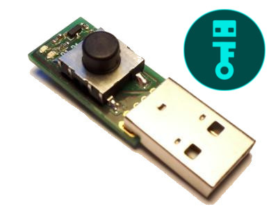
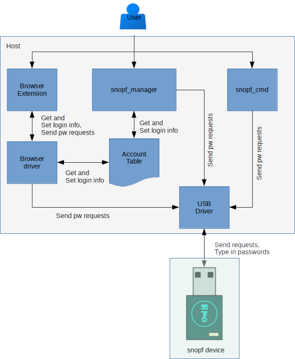
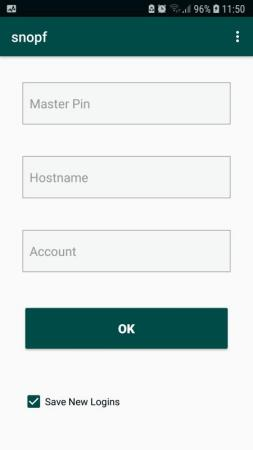

# snopf USB password token

## What is snopf?



snopf is a very simple, yet effective and easy to use USB password tool. The snopf USB device creates a unique and strong password for every service from the same 128 bit secret which never leaves the token.

Whenever snopf is plugged into the computer you can make a password request and then the red LED will light up. If you press the button within 10 seconds snopf will imitate a keyboard and type the password for the requested service.

snopf is designed as a hardware-based password generator to tackle the security issues most commonly encountered with stored passwords on ordinary PCs, such as reading of password files by malware or browser exploits. It generates passwords deterministically from a securely kept master secret unaccessible to software running on the host. 

For more details on security and how it works, see the section *Security considerations* and *Operation principle* below.
Instructions on how to build your own are found in the section *Hardware* and *Building the Firmware and Host Software*. A short manual on how to use snopf after you installed the software is found in *How to use it*.

## Advantages of snopf

* Very simple and robust design
* Easy to use
* You don't have to remember any passwords anymore (except preferably a master PIN for snopf)
* Every password is unique and as strong as the accessed service allows
* The actual password creation is only happening on the USB device
* It is possible to restore all passwords from a 12 word mnemonic representing the 128 bit secret
* It's more secure than a common pure software based password manager because the password creation is physically detached from the computer
* As snopf emulates a regular keyboard, no passwords are stored in the clipboard

### Advantage over Common Software Password Managers
Common software password managers are very good tools to create and manage strong passwords for all your logins. Still, there is a possibility of your computer being remotely attacked and an attacker is able to access your password database getting all your login credentials.
snopf is an improvement over these managers because an attacker can't access your snopf token remotely. All passwords are derived from the secret on the device which an attacker must have phyiscal access to. So there is an additional *physical barrier* for an attacker.


## Existing Tools

So far there are four tools that can send requests to the device:

1. `snopf_cmd`, a command line tool
2. `snopf_manager`, a graphical user interface
3. A browser extension for firefox (and soon also Google chrome)
4. An Android App

For advise on how to build these tools see section *Building the firmware and Host Software*.

`snopf_manager` and the browser extension make use of an *account table* which stores information about your logins on your computer. Every entry in this table has four fields:

1. `hostname` = Hostname or service name for the login, for example the email service `examplemail.com`
2. `account` = Your account at this service, for example the email address for the email service `my_mail_address@examplemail.com`
3. `password length` = The password length you set for this service, which defaults to the maximum length of 40. In the few cases where password length is limited by the service to something shorter you can change this setting
4. `password iteration` = An integer for every unique (hostname, account) combination which you increase if you have to set a new password for this combination for example after a databreach at the used service.

*Password iteration* is an integer for every (hostname, account) entry. It is set to 0 at the first password creation. But whenever you have to set a new password for an account of yours, for example because the service had been hacked or your password got leaked in another way, you create a new password by increasing this number by one. It is thus necessary to have the correct number available for each service and it makes therefore sense to regularly backup the account table. For more details see below.

If you install `snopf_manager` and the browser extension they will both look for the account table at *~/.snopf/snopf_manager/account_table.json*. You can add new accounts from both the browser extension and `snopf_manager` but you can only edit and remove existing accounts using `snopf_manager`.

An overview over all parts of the snopf software:



## Using snopf

### Browser plugin

An everyday usecase of snopf are user logins into web sites where you use the snopf browser plugin. The general process of a password request is outlined in the picture below.


The browser plugin can access the same account table as the snopf_manager so you can fill out the account field by selecting known accounts from the table. With the browser extension you can make password requests and you can select to store newly typed in hostname + account combinations in the account table, but you can't remove existing accounts or change their settings.

### snopf_cmd
`snopf_cmd` can also make password requests but, more importantly, it is (for now) the only tool that can change the secret on the device.

#### Interactive mode
`snopf_cmd` contains an interactive, minimalist shell to interact with the snopf USB device. Using this shell is necessary to change the master secret on the device.
Type
```
$ snopf_cmd -i
```
and type
```
> help
```
to get an overview over possible commands. To get help about a specific command type
```
> help COMMAND
```

You can also make password requests in interactive mode.

#### Change secret
To change or set the initial secret on snopf type
```
> change_secret SECRET
```
in interactive mode. `SECRET` can either be a 128 bit integer (in decimal or hex notation) or a 12 word mnemonic. If you type `change_secret` without an argument a new secret will be created from the computers randomness source.
You'll have to follow the instructions on the screen to set the new secret.

Be sure, that the computer you are using for setting the secret can be trusted. Of course you lose all security if you set the device's secret on a compromised machine. To be extra sure that no malware reads the master secret, a good idea might be to use an offline, "air gapped" PC with a fresh OS installation from trusted sources for setting the master secret.

##### 12 word mnemonic
The 128 bit secret can be expressed as a 12 word mnemonic as used and described in [BIP39](https://github.com/bitcoin/bips/blob/master/bip-0039.mediawiki) (as also used in and invented for the Bitcoin world). This makes storing or remembering the secret easier and less error prone.

#### Change keyboard delay
For some inputs (for example the KDE konsole) the speed of typing must be relatively slow or you can miss keyboard inputs consequently enter false passwords. The default is set to a value that should work with most inputs and is relatively slow.
With `snopf_cmd` you can change the keyboard delay of snopf to make it type slower or faster. In interactive mode run
```
$ set_keyboard_delay MS
```
with MS being the delay in milliseconds. The default value is 20 ms.

#### Password requests
`snopf_cmd` can be run with a string argument which will result in a raw password request using the argument:
```
$ snopf_cmd request_string
```
A raw request is the first 16 byte of the SHA256 hash of the typed in string without whitespaces.

You can find arguments and their explanation like password length and so on by typing
```
$ snopf_cmd --help
```
To make a request for an entry in the account table you can type something like
```
$ snopf_cmd hostname account --password_length=40
```
Which will result in a requst for hostname *hostname* with account *account* and the *password length* = 40. Note that for *password_iteration = 0* there is no change of the request string. A request for a password with *password_iteration = 1* would look like this:
```
$ snopf_cmd hostname account 1 --password_length=40
```

### snopf_manager
snopf_manager is first and foremost a GUI tool to manage the account table. Here you can create, delete and change entries. It uses the same account table as the browser extension. It is also used to make password requests outside of the browser. All unsaved changes to the account table will appear red to prevent changes by accident.


### snopf Android App
There is an app for Android phones that can make password requests. It works fairly well for single requests but so far doesn't have access to the account table.



## Restoring passwords

To restore passwords, for example after losing or damaging snopf, you need to be in possesion of the following data:

1. The snopf's secret (comfortably as a 12 word mnemonic)
2. The optional master PIN (if you used one)
3. The unique hostname + account + password length + password iteration combinations (the account table)

You might not absolutely need the account table if you have your logins, like email address and email service in your memory and just used the most secure passwords with default length. Even if you need to remember *password iteration* you can just try out low numbers there.

Apart from that it is advised to backup the account table and use a master PIN that you can remember. You should write down the 12 word mnemonic for the snopf secret and store at a safe place.

With the above information you will be able to recreate all your passwords.

## Security considerations
snopf isn't 100 % secure and a certain tradeoff between security, usability and economics has been made. Make sure to use snopf only with your own or trusted PCs. It is also assumed that an adversary does not come into physical possesion of your snopf. However, in case snopf gets lost or is stolen, a reasonable safe master passphrase (the two-factor authentication approach) will still fend off or at least slow the attacker, depending on the strength of this passphrase.

snopf has not been designed or further analyzed vs. more advanced attacks such as power analysis or timing side-channel attacks and could be theoretically vulnerable to either. Attacks of this and similar kinds are deemed outside the scope of the threat model that snopf defends against. So far, regular computers don't seem to allow detailed current measurement at their USB ports which could potentially be used for remote attacks. More sophisticated attacks such as relying on analyzing the microcontroller's electromagnetic emissions are not deemed a common threat.
Timing attacks are similarly not expected to be a huge issue. The SHA256 crypto primitive used by snopf runs in constant time. The iterated hashing to yield a password matching "password_valid" (as in Section *Operation principle*) will cause some timing variation for a minority of passworts. However, as snopf relies on a *manual* button press for replying with the password, a large amount of noise is added and makes analyses along this line a lot less feasible.

The ATtiny85 does not include a secure enclave (or similar) and reading out the microcontroller might be possible if an attacker has physical access. It can be made harder by setting the lockbits for the AVR but a capable attacker will be able to access the EEPROM data (where the secret is stored) eventually. A reasonable safe master passphrase will still prevent logins by an attacker at least for some time to create new passwords.

Passwords typed in by snopf can of course still be intercepted by a keylogger and might land in the RAM and swap memory of the host where malware might access them. Covering those attack vectors is likewise out of scope for snopf.
 
## Operation principle
snopf uses the SHA256 hashing algorithm as the only crypto primitive. Every password request sent by the host device will be concatenated with the secret and the SHA256 hash of the concatenation is the basis for the password. The [Z85 transformation](https://rfc.zeromq.org/spec:32/Z85/) is used to transform the hash into ASCII characters. Z85 includes most readable ASCII characters but excludes characters like quotation marks, which are regularly forbidden by password forms. 
Furthermore, the output of the Z85 transform is checked for four extra conditions, such as always having to contain a special character, as this is a frequent requirement on the password by many web sites. The conditions are that the output (the password) includes:

1. A capital letter
2. A lowercase letter
3. A number
4. A special character (like ! or ?)

The upper limit for a password length of 40 stems from the fact that Z85 encodes four bytes into five characters, which, for a 32 byte SHA256 hash, translates to 40 characters. Shorter passwords are created by truncating the output of the Z85 transform.

An absolute minimum for the password length is set by the four requirements to be four characters, as they are mutually exclusive, character-wise. Since there is no guarantee that every Z85 encoded SHA256 hash fulfills all four requirements, especially not a truncated string, the hashing might be iterated until a matching password is found, varying the input data. To ensure a quick password creation and to practically exclude the possibility of the iterating algorithm not to succeed the minimum password length is set to six.

The iterating algorithm is set to always terminate in less than 256 steps (because just one byte is manipulated). For given password lengths the following table shows the (theoretical) probability for the algorithm to fail and the probability to need 1 and 10 tries to retrieve a password. The probability is estimated assuming a geometric distribution with the probablity `P(k) = p * (1 - p)^(k-1)` to create a valid password in `k` tries, for a probability of a random password to be valid according to the extra conditions of `p`.The value of `p` has simply been numerically estimated here, from 100'000 trials (for each password length).

| Password length | mean | P(k=1) | P(k=10) | P(Failure) |
| ------------- | ------------- | ------------- | ------------- | ------------- |
| 6 | 3.416 | 0.293 | 0.0130 | 1.3e-39 |
| 10 | 1.570 | 0.637 | 6.99e-5 | 4.15e-113 |
| 20 | 1.090 | 0.917 | 1.625e-10 | 4.57e-277 |
| 30 | 1.023 | 0.978 | 1.413e-15 | ~ 0 |
| 40 | 1.007 | 0.993 | 2.511e-20 | ~ 0 |


Some services limit the length of passwords to some number lower than 40, for all other cases there is no reason to set the length of the password to anything but 40 as you obviously reduce the search space for brute-forcing the password.


Following is the algorithm for the password generation as it is implemented on the AVR (you can find an equivalent python implementation of this at `src/host/pc/password_generator.py`):

```
request_message := password request message sent by the host device (PC) of 16 bytes length
secret := the secret stored on the USB snopf device, also 16 bytes long
PW_LENGTH := requested length for the password, must be any integer between 6 and 40
PW := resulting password for the request, will be typed into the host machine when pressing the button
password_valid := PW includes a lowercase AND a capital AND a number AND a special character
```

```
DO
    PW_HASH := SHA256(secret || request_message)
    PW := first PW_LENGTH characters of Z85(PW_HASH)
    first byte of request_message = (first byte of request_message + 1) mod 256
WHILE not password_valid
```

---

The *request_message* can be any data of a length of 16 bytes but for the snopf tools using the hostname and account table it is defined as following:
```
request_message = first 16 bytes of SHA256(hostname || account || master-pin || password_iteration)
```
The *password_iteration* field will start at zero and we increase it by one every time we have to create a new password for a given hostname and account combination because of a data breach, use of a untrusted machine etc.
All fields are UTF-8 encoded strings, including *password_iteration*, without any terminating characters like newline or null.

If the *password_iteration* field is 0 it will be omitted.

## Hardware
You can find a KiCad project for snopf in the `hardware` subfolder and also a PDF of the current schematic [here](https://github.com/snopf/snopf/blob/master/readme/schematic.pdf). The KiCad project also includes a PCB layout for a SMD version.

Bill of materials for the SMD version:
* ATTINY85-20SU SO(1)
* Resistor 10k 0603 (3)
* Resistor 220R 0603 (2)
* Resistor 1k 0603 (1)
* Resistor 1k5 0603 (1)
* Resistor 68R (2)
* Capacitor 18pF 0603 (2)
* Capacitor 100n 0603 (1)
* Tantalum Capacitor 4u7 EIA-3216-18 (1)
* Crystal 12 Mhz 4 Pin 12.000000-MJ (1)
* LED green 0603 (1)
* LED red 0603 (1)
* USB connector (1)
* Zener Diode 3,6V Mini Melf (2)
* Button Schurter 1241.1618.XX (1)
* NPN transistor 2N2222A SOT-23 (1)


## Building the Firmware and Host Software

For running the python code and building the snopf tools you should create a virtualenv by running 
```
$ ./setup_py_env.sh
```
in the `src` directory.

All AVR code is located in `src/avr` and all other code (`snopf_manager`, `snopf_cmd` and the browser extension) in `src/host`.

You can compile the AVR code and program the AVR using the standard GNU toolchain using
```
$ make program
```
in the avr source directory. You'll probably have to alter the `Makefile` for your kind of programmer.

There also exists a bootloader written for this project, you can find it here [snopf bootloader](https://github.com/snopf/snopf_bootloader) so that you can update the code on the device via USB. The bootloader is not necessary but it comes in handy for updating the firmware.

----

To build the binaries for `snopf_cmd`, `snopf_manager` and the native app for the browser driver (see below) from the python sources using PyInstaller, run
```
$ make
```
in `src/host/pc`. The output directory for the binaries is `src/host/dist`.

You can also run `make` in the parent directory to also pack the browser extension (see below).

To install the binaries of *snopf_cmd* and *snopf_manager* to `~/.snopf` run
```
$ ./install.sh
```
in `src/host`.

The browser extension for firefox and chrome depends on a so called *native app* which is an application running outside of the browser. In the case of snopf it's a small script that takes charge of USB communication and account table management. To install the binary of this native app, run
```
$ ./install_native_app.sh
```
It will be installed to `~/.snopf/browser_driver` which is the place where the browser extension will look for it.

There is an udev rule for allowing USB acces to snopf located in `src/host` which you can copy to `/etc/udev/rules.d` or you can simply run
```
$ ./install_usb_rule.sh
```

### Browser extension
The firefox extension is located at `src/host/browser_extension` and can be packed into a zip file suitable for the browser by simply running `make` there.

There doesn't exist a signed version for the firefox browser extension yet so to permanently install the addon you would have to change the firefox settings  explictly to allow the installation of unsigned addons.
If you know what you are doing you can do this (for most firefox versions) by opening the 
```
about:config
```
page and set the value for 
```
xpinstall.signatures.required to false.
```
After doing that you can install the zip file under *about:addons*. If you change the setting back to *true* the addon will be deactivated by firefox.

Alternatively you can also temporarily install the addon by entering
```
about:debugging#/runtime/this-firefox
```
into the adress bar and and clicking *Load Temporary Add-on...*.

### Android App
The Android App is located at `src/host/android` as an project for `androidstudio` and can be build and applied to an Android phone using the same.

## TODO
* Windows version
* More tests, especially for browser extension
* Casing for the USB device
* Make the QT tool more feature complete (allow same functionality as in the command
line tool)
* More user friendly secret setting like dice rolls or the like
* Write a startup script to use snopf for logging in into your computer
* Acquire a open source USB product ID
* encrypt / decrypt account table with master passphrase
* Share account table between devices

## Disclaimer
There is no warranty for data security and integrity or security issues of any kind. Care has been taken to make this a device that increases your security, however security bugs are possible.

You are free to use it and copy it but it comes **without any guarantees**.

## Links

* snopf makes use of the excellent [V-USB driver](https://www.obdev.at/products/vusb/index.html)

## License
All code and schematics / hardware layouts are licensed under GNU General Public License (GPL) Version 2, see file License.txt.
